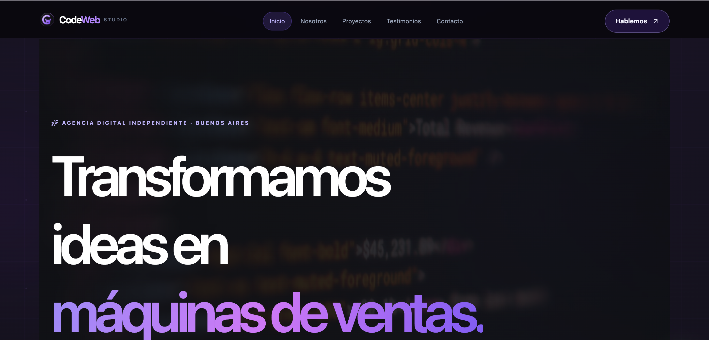
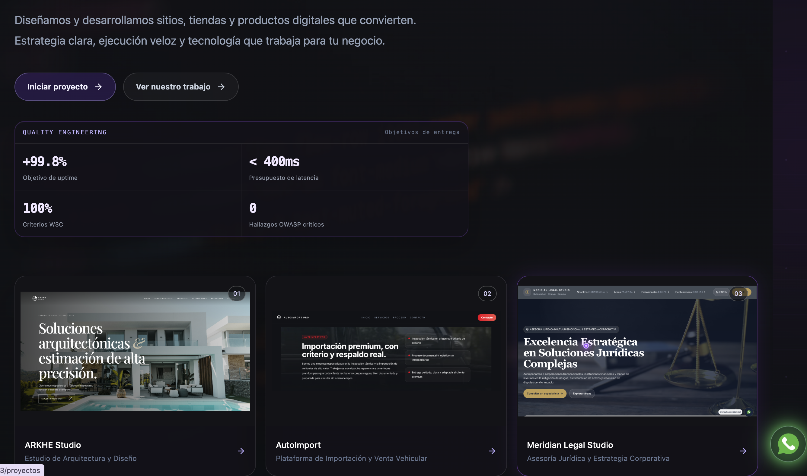
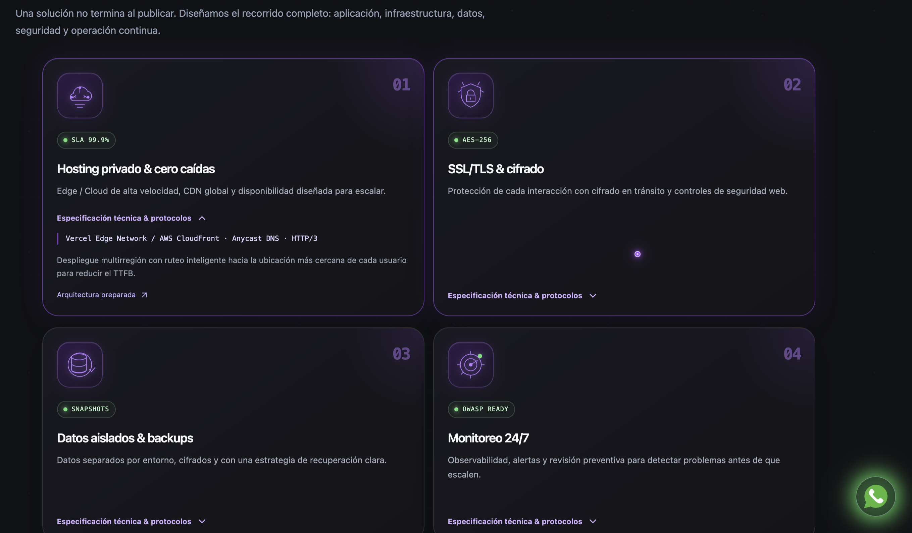
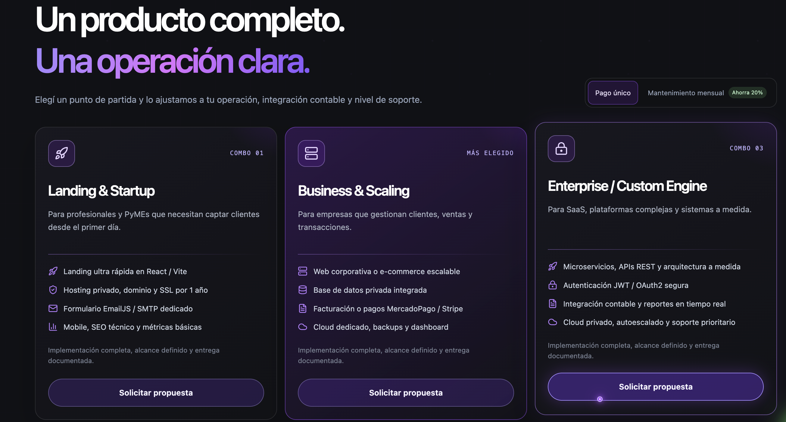
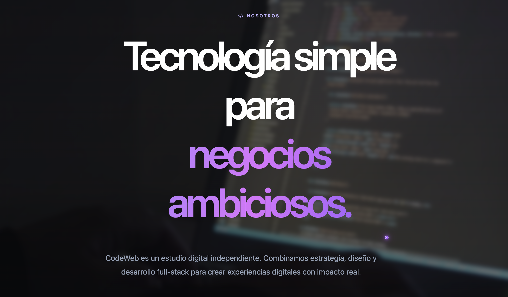

# **CodeWeb — Studio Digital & Desarrollo Web**

**CodeWeb** es una aplicación web moderna basada en **Vite**, **React** y **TypeScript**. Está diseñada para presentar una experiencia profesional de *landing page* de alto impacto, priorizando el **rendimiento**, la **arquitectura limpia**, la **adaptabilidad responsiva** y una **interfaz gráfica neón de nivel premium**.

El proyecto integra un *layout* principal con **animaciones optimizadas por GPU**, un **portafolio interactivo de proyectos**, un **formulario de contacto dinámico** con selección de servicios y un **banner de gestión de privacidad y cookies**. Toda la identidad visual y los estilos globales están construidos sobre **Tailwind CSS**.

---

## **Capturas del proyecto**











---

## **Configuración del Entorno**

El proyecto está inicializado sobre el ecosistema estándar de **Vite + React**. Para desplegar el entorno de desarrollo local, se utiliza el gestor de paquetes configurado en el proyecto.

El flujo de trabajo contempla la **instalación de dependencias**, el **servidor de desarrollo en tiempo real (HMR)** y el **proceso de compilación para producción**.

---

## **Arquitectura y Desarrollo**

La carpeta `src/` concentra el **código fuente** y los **estilos globales**:

* **`App.tsx`**: Componente orquestador que centraliza el estado global, el control del banner de privacidad y la integración de secciones.
* **`src/components/`**: Módulos independientes y reutilizables que encapsulan la lógica del **portafolio**, el **formulario de contacto**, las **propuestas de servicio** y la **arquitectura técnica**.

El sitio está optimizado con un enfoque **Mobile-First** y testeado en resoluciones reducidas. Las transiciones visuales se adaptan a las preferencias del sistema (`prefers-reduced-motion`) para garantizar un **rendimiento fluido** en todo tipo de dispositivos.

---

## **Compilación y Producción**

El proceso de construcción para producción utiliza el compilador de **TypeScript** en modo estricto y el empaquetador de **Vite**, generando los activos finales optimizados dentro del directorio `/dist`.

El archivo `index.html` establece los metadatos esenciales, el *viewport* responsivo y la carga de los módulos principales. El estado del banner de aceptación se persiste en el **`localStorage` del navegador** para respetar las preferencias del usuario en sesiones futuras.

---

## **Archivos Clave del Sistema**

* **`src/App.tsx`**: Estructura principal y control de flujo de la aplicación.
* **`src/index.css`**: Hojas de estilo globales, animaciones personalizadas y reglas del puntero/scroll.
* **`src/components/`**: Módulos de interfaz de usuario de alta modularidad.
* **`terms.html`**: Documento legal independiente para los términos y condiciones del servicio.

---

## **Ejecución de Comandos**

El ciclo de vida del proyecto se gestiona mediante los comandos declarados en el archivo `package.json`:

```bash
# Instalación de dependencias
npm install

# Servidor de desarrollo local
npm run dev

# Compilación y validación de tipos para producción
npm run build

# Vista previa de la build de producción
npm run preview
